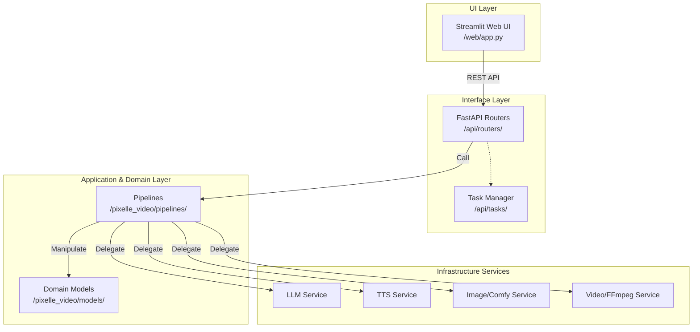

# 架构设计深度解析

**目标读者**：架构师、高级开发人员。

## 目录结构图解

项目采用了典型的**领域驱动分层架构（Layered Architecture）**，将核心业务与 HTTP/UI 隔离：

- `/api/`：**接入层（Interface）**，负责 FastAPI 路由解析、请求校验（`schemas/`）、CORS 配置以及后台异步任务调度（`tasks/`）。
- `/web/`：**展示层（UI）**，基于 Streamlit 构建的前端页面逻辑，通过调用 API 层实现交互。
- `/pixelle_video/`：**领域层与应用层（Domain & Application）**，系统的绝对核心。
  -------------------------------------------------------------------------------

  -
  - `pipelines/`：编排具体视频生成的业务流（如 `standard.py`, `linear.py`）。
  - `services/`：具体的基础能力服务（TTS 转换、LLM 对话、视频合成、帧处理）。
  - `models/`：业务核心数据结构（视频上下文、媒体素材、分镜脚本 `storyboard.py`）。
  - `prompts/`：统一管理的各类 LLM Prompt 模板。

## 架构模式分析

项目使用了**管线模式（Pipeline Pattern）**和**依赖注入/适配器模式**。视频生成步骤极多（脚本->配音->画面->合成），`pipelines` 将这一复杂过程拆解为标准化的生命周期节点；底层 `services` 封装了各类第三方能力的差异，保证 Pipeline 层的代码纯粹性。

## 可视化架构图

