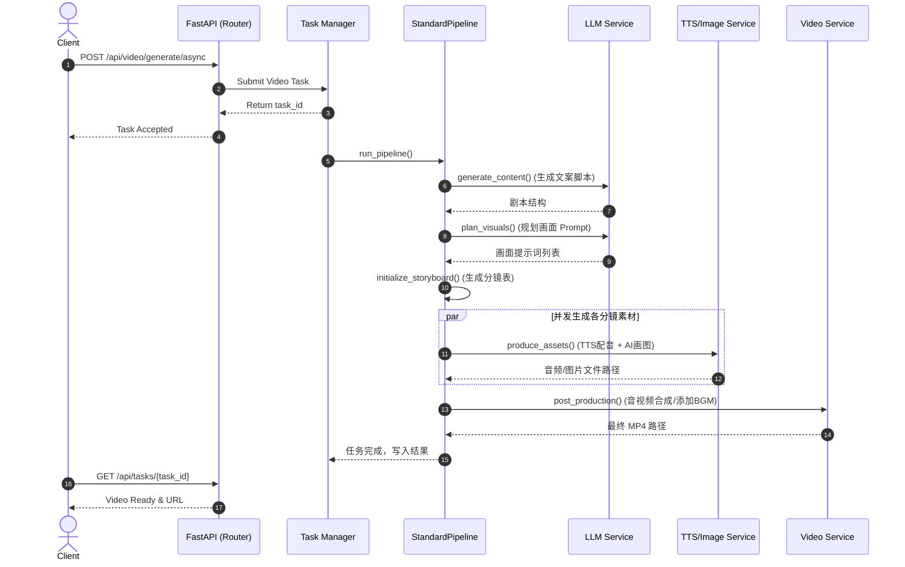

# 核心业务逻辑流转

**目标读者**：需要修改业务逻辑的开发者。

## 核心链路分析
**“异步视频生成流水线”** (通过 `StandardPipeline` 驱动)。
流水线的核心逻辑是将用户的初始 Prompt（甚至只是一句话），逐渐膨胀为一份详尽的结构化 `Storyboard`（分镜脚本），然后再将脚本逐帧物化为图像和音频，最后压制出片。

## 可视化时序图

## 数据流向
在整个流程中，`PipelineContext` 贯穿始终。初始只包含 `user_prompt` 和基础配置。随后：
1. LLM 阶段为其注入 `script`（文案）和 `title`。
2. 生成阶段创建并填充 `storyboard` 对象，其中包含了 `StoryboardFrame`（单帧）。
3. Asset 阶段为每个 `Frame` 填入本地生成的 `image_path` 和 `audio_path`。
4. 最终输出包装为 `VideoGenerationResult` 提供给 API 层返回。